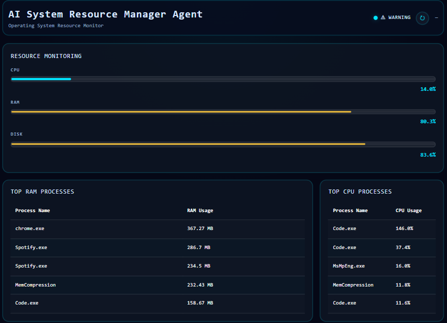
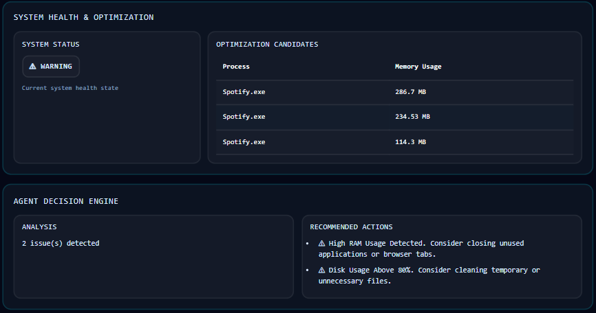
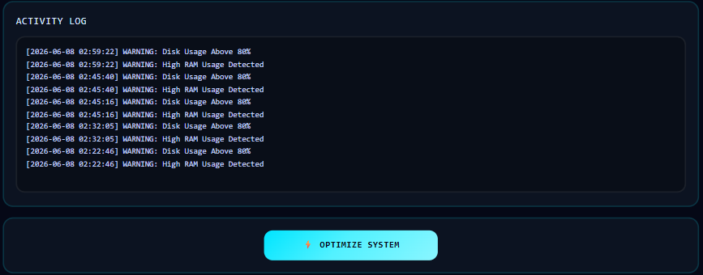

# AI System Resource Manager Agent

A system monitoring and optimization application developed for an Operating Systems project.

The project monitors CPU, RAM, and Disk usage, analyzes running processes, generates recommendations based on system conditions, and provides a web-based dashboard for visualization and management.

The application was developed using Python, Flask, and psutil.

---

## Project Overview

The system follows the basic structure of an intelligent agent:

Observe → Analyze → Decide → Act

The monitoring module collects resource usage information from the operating system. The analyzer identifies resource-intensive processes. The decision engine evaluates system conditions and generates recommendations. The action module performs safe optimization actions and records them in a log file.

---

## Functionality

- Monitor CPU usage
- Monitor RAM usage
- Monitor Disk usage
- Identify top CPU-consuming processes
- Identify top RAM-consuming processes
- Evaluate system health status
- Generate recommendations based on resource usage
- Display optimization candidates
- Record actions and events in a log file
- Provide a web-based dashboard for monitoring

---

## Development History

The project was developed in three stages.

**Stage 1 – Terminal Application**

File:

```text
main.py
```

Implemented basic monitoring, process analysis, and recommendation generation through a terminal interface.

**Stage 2 – Desktop GUI**

File:

```text
dashboard.py
```

Added a graphical interface using CustomTkinter for real-time monitoring.

**Stage 3 – Web Dashboard (Final Version)**

File:

```text
app.py
```

Migrated the project to a Flask-based web application and redesigned the user interface for easier monitoring and management.

The final version of the project is the Flask implementation in `app.py`.

---

## Screenshots

Dashboard



Monitoring



Optimization



---

## Technologies Used

- Python
- Flask
- psutil
- HTML
- CSS
- Bootstrap

---

## Project Structure

```text
AI-System-Resource-Manager-Agent
│
├── modules/
│   ├── monitor.py
│   ├── analyzer.py
│   ├── decision_engine.py
│   ├── actions.py
│   ├── notifier.py
│   └── logger.py
│
├── templates/
│   └── index.html
│
├── static/
│   └── style.css
│
├── screenshots/
│
├── logs/
│
├── app.py
├── dashboard.py
├── main.py
├── requirements.txt
├── README.md
└── .gitignore
```

---

## Installation

Clone the repository:

```bash
git clone https://github.com/aperfectrio/AI-System-Resource-Manager-Agent.git
```

Move into the project directory:

```bash
cd AI-System-Resource-Manager-Agent
```

Create a virtual environment:

```bash
python -m venv venv
```

Activate the virtual environment:

```bash
venv\Scripts\activate
```

Install dependencies:

```bash
pip install -r requirements.txt
```

---

## Running the Application

Run the Flask application:

```bash
python app.py
```

Open the following address in a web browser:

```text
http://127.0.0.1:5000
```

---

## Author

Rio  
Undergraduate Student, Computer Science  
Sejong University
